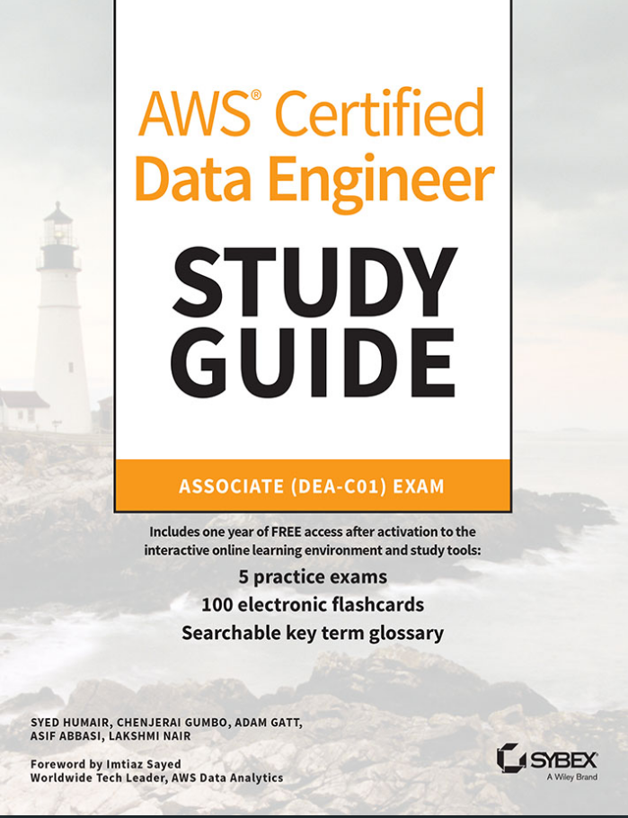
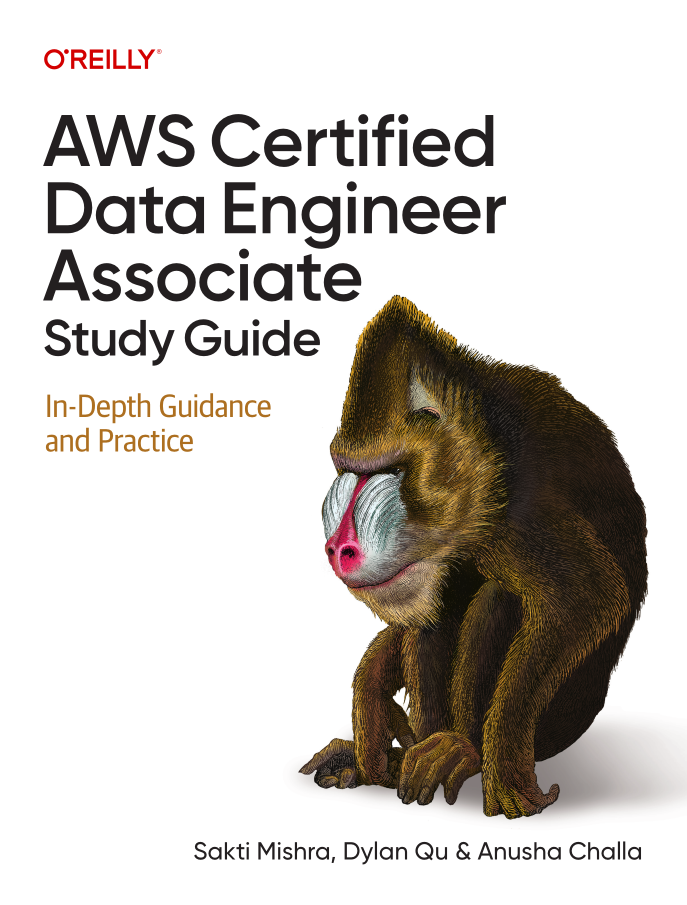
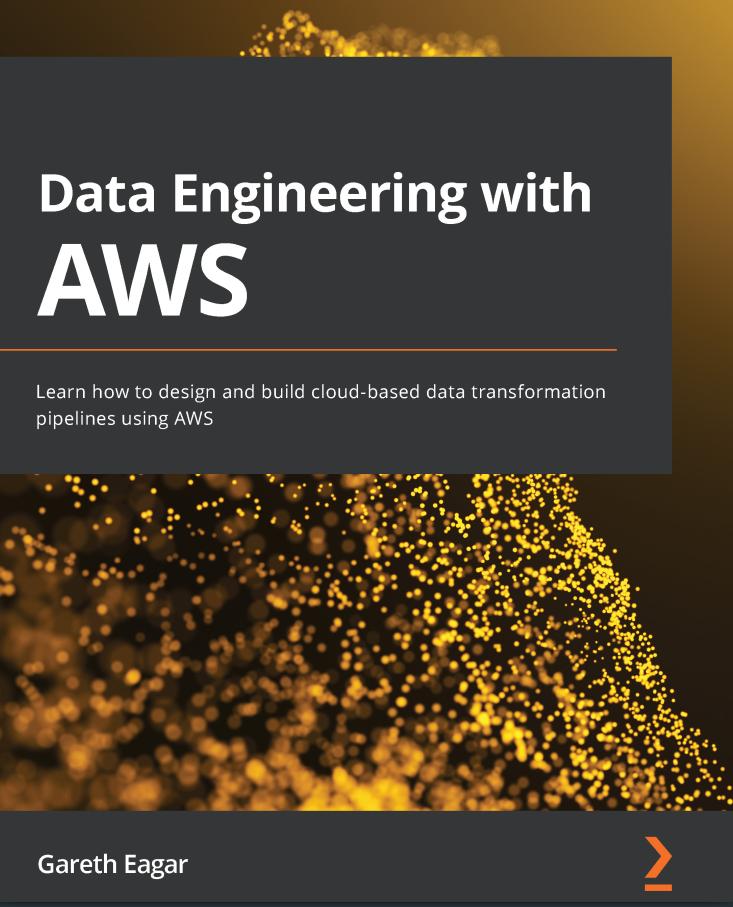
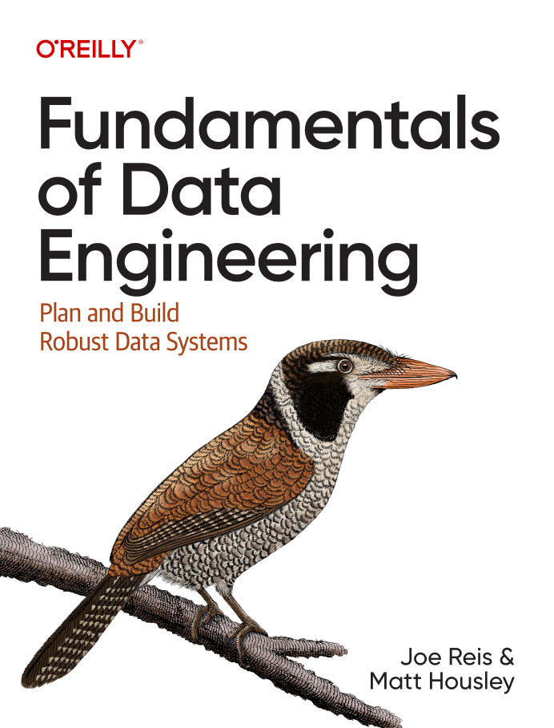

# **AWS Certified Data Engineer - Associate (DEAC01)**

[**AWS Certified Data Engineer - Associate (DEAC01) Exam Guide**](https://docs.aws.amazon.com/aws-certification/latest/examguides/data-engineer-associate-01.html) 

This study guide will help you pass the newer [AWS Certified Data Engineer - Associate](https://aws.amazon.com/certification/certified-data-engineer-associate/) exam. Ideally, you should reference this guide while working through the following material:

1. Stephane Maarek's and Frank Kane [AWS Certified Data Engineer Associate 2026 - Hands On!](https://www.udemy.com/course/aws-data-engineer/)

2. The FAQs for the most critical services, included in the recommended reading list below

3. Tutorials Dojo's [AWS Certified Data Engineer - Associate](https://portal.tutorialsdojo.com/courses/aws-certified-data-engineer-associate-practice-exam-dea-c01/) Practice Exams

4. Tutorials Dojo's [AWS Certified Data Engineer - Associate](https://tutorialsdojo.com/new-aws-certified-data-engineer-associate-dea-c01/) Overview

5. Tutorials Dojo's Exam Free[AWS Certified Data Engineer - Associate - Free - 20 Questions](https://portal.tutorialsdojo.com/courses/free-aws-certified-data-engineer-associate-practice-exam-sampler/)

6. AWS Certified Data Engineer - Associate (DEA-C01) [Full Course In 285min] [AWS Certified Solutions Architect](https://www.youtube.com/watch?v=6G0bLDIcO7Y)

## **Important - Learning**

[orchestrate-an-etl-pipeline](https://docs.aws.amazon.com/pdfs/prescriptive-guidance/latest/patterns/prescriptive-guidance.pdf#orchestrate-an-etl-pipeline-with-validation-transformation-and-partitioning-using-aws-step-functions), last accessed on 30 December 2025.
[What is a Data Lake?](https://aws.amazon.com/what-is/data-lake/)
[Learn more about S3 bucket naming rules](https://docs.aws.amazon.com/AmazonS3/latest/userguide/bucketnamingrules.html)
[AWS CloudShell service](https://us-east-2.console.aws.amazon.com/cloudshell/home)
[AWS Management Console - IAM Policies](https://console.aws.amazon.com/iamv2/home?#/policies)

## **Athena**

[Considerations and Limitations for CTAS Queries](https://docs.aws.amazon.com/athena/latest/ug/considerations-ctas.html)
[Airbnb blog post about the problem of small files](https://medium.com/airbnb-engineering/on-spark-hive-and-small-files-an-in-depth-look-at-spark-partitioning-strategies-a9a364f908)
[Partitioning and bucketing in Athena](https://docs.aws.amazon.com/athena/latest/ug/ctas-partitioning-and-bucketing.html)
[Partition Projection with Amazon Athena](https://docs.aws.amazon.com/athena/latest/ug/partition-projection.html)
[Using EXPLAIN and EXPLAIN ANALYSE in Athena](https://docs.aws.amazon.com/athena/latest/ug/athena-explain-statement.html)
[Functions in Amazon Athena](https://docs.aws.amazon.com/athena/latest/ug/functions.html)
[Performance Tuning in Athena](https://docs.aws.amazon.com/athena/latest/ug/performance-tuning.html)
[Using Amazon Athena Federated Query](https://docs.aws.amazon.com/athena/latest/ug/connect-to-a-data-source.html)
[Athena Query Federation SDK](https://docs.aws.amazon.com/athena/latest/ug/connect-data-source-federation-sdk.html)
[Explore your data lake using Amazon Athena for Apache Spark](https://aws.amazon.com/blogs/big-data/explore-your-data-lake-using-amazon-athena-for-apache-spark/)
[Using Athena ACID transactions](https://docs.aws.amazon.com/athena/latest/ug/acid-transactions.html)
[Tag-Based IAM Access Control Policies](https://docs.aws.amazon.com/athena/latest/ug/tags-access-control.html)

## **SageMaker Components**
- [Amazon SageMaker](https://aws.amazon.com/sagemaker/)
- [Amazon SageMaker Ground Truth](https://aws.amazon.com/sagemaker/data-labeling/)
- [Amazon SageMaker Data Wrangler](https://aws.amazon.com/sagemaker/data-wrangler)
- [Amazon SageMaker Clarify](https://aws.amazon.com/sagemaker/clarify)
- [Amazon SageMaker Notebooks](https://aws.amazon.com/sagemaker/notebooks/)
- [Amazon SageMaker Autopilot](https://aws.amazon.com/sagemaker/autopilot)
- [Amazon SageMaker JumpStart](https://aws.amazon.com/sagemaker/jumpstart)
- [Amazon SageMaker Experiments](https://aws.amazon.com/sagemaker/experiments/)
- [Amazon SageMaker Model Monitor](https://aws.amazon.com/sagemaker/model-monitor/)

### **AWS Serivces for AI**
- [Amazon Transcribe](https://aws.amazon.com/transcribe/)
- [Amazon Textract](https://aws.amazon.com/textract/)
- [Amazon Comprehend](https://aws.amazon.com/comprehend/)
- [Amazon Rekognition](https://aws.amazon.com/rekognition/)
- [Amazon Forecast](https://aws.amazon.com/forecast/)
- [Amazon Fraud Detector](https://aws.amazon.com/fraud-detector/)
- [Amazon Personalize](https://aws.amazon.com/personalize/)

### **AWS Services for Generative AI**
- [Blog post - Get started with generative AI on AWS using Amazon SageMaker JumpStart](https://aws.amazon.com/blogs/machine-learning/get-started-with-generative-ai-on-aws-using-amazon-sagemaker-jumpstart/)
- [Amazon Bedrock](https://aws.amazon.com/bedrock/)
- [Amazon Titan](https://aws.amazon.com/bedrock/titan/)

### **Books**

### **Whitepapers**

This whitepaper has examined some tools available on AWS for big data analytics. This paper provides a good reference point when starting to design your big data applications. However, there are additional aspects you should consider when selecting the right tools for your specific use case. In general, each analytical workload has certain characteristics and requirements that dictate which tool to use, such as:

- How quickly do you need analytic results: in real time, in seconds, or is an hour a more appropriate time frame?
- How much value will these analytics provide your organization and what budget constraints exist?
- How large is the data and what is its growth rate?
- How is the data structured?
- What integration capabilities do the producers and consumers have?
- How much latency is acceptable between the producers and consumers?
- What is the cost of downtime or how available and durable does the solution need to be?
- Is the analytic workload consistent or elastic?

**Reading**

[big-data-analytics-options](https://docs.aws.amazon.com/whitepapers/latest/big-data-analytics-options/welcome.html)

**Notes:** If at any point you find yourself feeling uncertain of your progress and in need of more time, you can postpone your AWS exam date. Be sure to also keep up with the ongoing discussions in [r/AWSCertifications](https://www.reddit.com/r/AWSCertifications/) as you will find relevant exam tips, studying material, and advice from other exam takers. 

Before experimenting with AWS, it's very important to be sure that you know what is [free tier](https://aws.amazon.com/free/?all-free-tier.sort-by=item.additionalFields.SortRank&all-free-tier.sort-order=asc&awsf.Free%20Tier%20Types=*all&awsf.Free%20Tier%20Categories=*all) and what isn't. 

Relevant Free Tier FAQs can be found here. Finally, Udemy often has their courses go on sale from time to time. It might be worth waiting to purchase either the Tutorial Dojo practice exam or Stephane Maarek's course depending on how urgently you need the content.

To level up your NotebookLM as a DEA-C01 instructor, the "Golden Tip" isn't just about what the AI knows, but how it cross-references your data.

Here is the translated version ready for your guide:

🌟 Golden Tip: The "Cross-Source Synthesis" Power

- The greatest advantage of using NotebookLM as an instructor is not just its ability to explain concepts, but its power to identify gaps and specific connections between the official Exam Guide and technical whitepapers. To get the most out of it, use the Comparative Scenario Analysis strategy.

- How to apply it: Don't just ask "Explain AWS Glue." Instead, after uploading the Exam Guide and an architecture Whitepaper, use the following prompt:

> "Professor, based on the Exam Guide, identify which AWS Glue features are considered 'In-Scope' for the DEA-C01 and cross-reference them with the 'Best Practices' document. 
>
> Create a comparative table showing: Feature / When to Use / Cost or Performance Limit that I must memorize for the exam."

**Why this works:**

**Exam Focus:** You avoid wasting time studying service functions that are "Out-of-Scope."

**Real-World Context:** you learn the "AWS Way" (Cost vs. Performance), which is the foundation of the "Choose the best solution" questions.

**Source Citations:** NotebookLM will place small numbers (citations) next to the answer. Click them to see exactly which page of the original PDF that rule comes from. This strengthens your visual memory of the official documentation.

**AWS Certified Data Engineer - Associate (DEAC01) Exam Guide**

The AWS Certified Data Engineer - Associate (DEA-C01) exam validates a candidate's ability to implement data pipelines and to monitor, troubleshoot, and optimize cost and performance issues in accordance with best practices.

Note: AWS exam guides are periodically reviewed and revised to ensure that each certification exam tests skills and AWS services and features that are current and relevant for the job role(s) that the certification is designed to target. Exam guide revisions will be published at least one month before changes are reflected on your exam. Check the Revisions section for a summary of changes.

### Topics 
- [Introduction](#introduction)
- [Target Candidate Description](#target-candidate-description)
- [Exam content](#exam-content)
- [Content outline](#content-outline)
- [AWS Services for the Exam](#aws-services-for-the-exam)
- [Content Domain 1: Data Ingestion and Transformation](#content-domain-1-data-ingestion-and-transformation)
- [Content Domain 2: Data Store Management](#content-domain-2-data-store-management)
- [Content Domain 3: Data Operations and Support](#content-domain-3-data-operations-and-support)
- [Content Domain 4: Data Security and Governance](#content-domain-4-data-security-and-governance)
- [In-Scope AWS Services](#in-scope-aws-services)
- [Out-of-Scope AWS Services](#out-of-scope-aws-services)
- [Revisions](#revisions)
- [Survey](#survey)

### Introduction

The AWS Certified Data Engineer - Associate (DEA-C01) exam validates a candidate's ability to implement data pipelines and to monitor, troubleshoot, and optimize cost and performance issues in accordance with best practices. he exam also validates a candidate's ability to complete the following tasks:
- Ingest and transform data, and orchestrate data pipelines while applying programming concepts.
- Choose an optimal data store, design data models, catalog data schemas, and manage data lifecycles.
- Operationalize, maintain, and monitor data pipelines. Analyze data and ensure data quality.
- Implement appropriate authentication, authorization, data encryption, privacy, and governance. Enable logging.

### Target Candidate Description

The target candidate should have the equivalent of 2–3 years of experience in data engineering.
The target candidate should understand the effects of volume, variety, and velocity on data ingestion, transformation, modeling, security, governance, privacy, schema design, and optimal data store design. Additionally, the target candidate should have at least 1–2 years of hands-on experience with AWS services.

### Recommended general IT knowledge

The target candidate should have the following general IT knowledge:
- Setup and maintenance of extract, transform, and load (ETL) pipelines from ingestion to destination
- Application of high-level but language-agnostic programming concepts as required by the pipeline
- How to use Git commands for source control
- How to use data lakes to store data
- General concepts for networking, storage, and compute
- General concepts of vectors Recommended AWS knowledge

The target candidate should have the following AWS knowledge:
- How to use AWS services to accomplish the tasks listed in the Introduction section of this exam guide
- An understanding of the AWS services for encryption, governance, protection, and logging of all data that is part of data pipelines
- The ability to compare AWS services to understand the cost, performance, and functional differences between services
- How to structure SQL queries and how to run SQL queries on AWS services
- An understanding of how to analyze data, verify data quality, and ensure data consistency by using AWS services 

Job tasks that are out of scope for the target candidate The following list contains job tasks that the target candidate is not expected to be able to perform. 

This list is non-exhaustive. These tasks are out of scope for the exam:
- Perform ML training and inferences.
- Demonstrate knowledge of programming language-specific syntax.
- Draw business conclusions based on data.

## Exam content

### Response types

There are two types of questions on the exam:
- **Multiple choice:** Has one correct response and three incorrect responses (distractors)
- **Multiple response:** Has two or more correct responses out of five or more response options

Select one or more responses that best complete the statement or answer the question.
Distractors, or incorrect answers, are response options that a candidate with incomplete knowledge or skill might choose. Distractors are generally plausible responses that match the content area.

Unanswered questions are scored as incorrect; there is no penalty for guessing. The exam includes **50 questions that affect your score**.
The exam includes **15 unscored questions that do not affect your score**. AWS collects information about performance on these unscored questions to evaluate these questions for future use as scored questions. 

These unscored questions are not identified on the exam

The **AWS Certified Data Engineer - Associate (DEA-C01)** exam has a pass or fail designation. The exam is scored against a minimum standard established by AWS professionals who follow certification industry best practices and guidelines.

Your results for the exam are reported as a scaled score of **100–1,000**. The minimum passing score is **720**. Your score shows how you performed on the exam as a whole and whether you passed. Scaled scoring models help equate scores across multiple exam forms that might have slightly
different difficulty levels.

Your score report could contain a table of classifications of your performance at each section level. The exam uses a compensatory scoring model, which means that you do not need to achieve a passing score in each section. You need to pass only the overall exam.

Each section of the exam has a specific weighting, so some sections have more questions than other sections have. The table of classifications contains general information that highlights your strengths and weaknesses. Use caution when you interpret section-level feedback.

### **Unscored content**
The exam includes **15 unscored questions that do not affect your score**. AWS collects information about performance on these unscored questions to evaluate these questions for future use as scored questions. These unscored questions are not identified on the exam.

### **Exam results**
The AWS Certified Data Engineer - Associate (DEA-C01) exam has a pass or fail designation. The exam is scored against a minimum standard established by AWS professionals who follow certification industry best practices and guidelines.

Your results for the exam are reported as a scaled score of 100–1,000. The minimum passing score is 720. Your score shows how you performed on the exam as a whole and whether you passed. Scaled scoring models help equate scores across multiple exam forms that might have slightly
different difficulty levels.

Your score report could contain a table of classifications of your performance at each section level. The exam uses a compensatory scoring model, which means that you do not need to achieve a passing score in each section. You need to pass only the overall exam.

Each section of the exam has a specific weighting, so some sections have more questions than other sections have. The table of classifications contains general information that highlights your strengths and weaknesses. Use caution when you interpret section-level feedback.

### **Content outline**
This exam guide includes weightings, content domains, and task statements for the exam. This guide does not provide a comprehensive list of the content on the exam. However, additional context for each task statement is available to help you prepare for the exam.

The exam has the following content domains and weightings:

- Content Domain 1: **Data Ingestion and Transformation (34% of scored content)**
- Content Domain 2: **Data Store Management (26% of scored content)**
- Content Domain 3: **Data Operations and Support (22% of scored content)**
- Content Domain 4: **Data Security and Governance (18% of scored content)**

### **AWS Services for the Exam**

The AWS Certified Data Engineer - Associate exam covers specific AWS services that are relevant to data engineers. Understanding which services are in scope can help you focus your preparation efforts.

For detailed information about the AWS services covered in the exam, see the following section:
- In-Scope AWS Services

## Content Domain 1: Data Ingestion and Transformation

### **Tasks**

- [Task 1.1: Perform data ingestion](#task-11-perform-data-ingestion)
- [Task 1.2: Transform and process data](#task-12-transform-and-process-data)
- [Task 1.3: Orchestrate data pipelines](#task-13-orchestrate-data-pipelines)
- [Task 1.4: Apply programming concepts](#task-14-apply-programming-concepts)

### **Task 1.1: Perform data ingestion**

- Skill 1.1.1: Read data from streaming sources (for example, Amazon Kinesis, Amazon Managed Streaming for Apache Kafka [Amazon MSK], Amazon DynamoDB Streams, AWS Database Migration Service [AWS DMS], AWS Glue, Amazon Redshift).
- Skill 1.1.2: Read data from batch sources (for example, Amazon S3, AWS Glue, Amazon EMR, AWS DMS, Amazon Redshift, AWS Lambda, Amazon AppFlow).
- Skill 1.1.3: Implement appropriate configuration options for batch ingestion.
- Skill 1.1.4: Consume data APIs.
- Skill 1.1.5: Set up schedulers by using Amazon EventBridge, Apache Airflow, or time-based schedules for jobs and crawlers.
- Skill 1.1.6: Set up event triggers (for example, Amazon S3 Event Notifications, EventBridge).
- Skill 1.1.7: Call a Lambda function from Kinesis.
- Skill 1.1.8: Create allowlists for IP addresses to allow connections to data sources.
- Skill 1.1.9: Implement throttling and overcoming rate limits (for example, DynamoDB, Amazon RDS, Kinesis).
- Skill 1.1.10: Manage fan-in and fan-out for streaming data distribution.
- Skill 1.1.11: Describe replayability of data ingestion pipelines.
- Skill 1.1.12: Define stateful and stateless data transactions

### **Task 1.2: Transform and process data**

- Skill 1.2.1: Optimize container usage for performance needs (for example, Amazon Elastic Kubernetes Service [Amazon EKS], Amazon Elastic Container Service [Amazon ECS]).
- Skill 1.2.2: Connect to different data sources (for example, Java Database Connectivity [JDBC], Open Database Connectivity [ODBC]).
- Skill 1.2.3: Integrate data from multiple sources.
- Skill 1.2.4: Optimize costs while processing data.
- Skill 1.2.5: Implement data transformation services based on requirements (for example, Amazon EMR, AWS Glue, Lambda, Amazon Redshift).
- Skill 1.2.6: Transform data between formats (for example, from .csv to Apache Parquet).
- Skill 1.2.7: Troubleshoot and debug common transformation failures and performance issues.
- Skill 1.2.8: Create data APIs to make data available to other systems by using AWS services.
- Skill 1.2.9: Define volume, velocity, and variety of data (for example, structured data, unstructured data).
- Skill 1.2.10: Integrate large language models (LLMs) for data processing.

### **Task 1.3: Orchestrate data pipelines**
- Skill 1.3.1: Use orchestration services to build workflows for data ETL pipelines (for example, Lambda, EventBridge, Amazon Managed Workflows for Apache Airflow [Amazon MWAA], AWS Step Functions, AWS Glue workflows).
- Skill 1.3.2: Build data pipelines for performance, availability, scalability, resiliency, and fault tolerance.
- Skill 1.3.3: Implement and maintain serverless workflows.
- Skill 1.3.4: Use notification services to send alerts (for example, Amazon Simple Notification Service [Amazon SNS], Amazon Simple Queue Service [Amazon SQS]).

### **Task 1.4: Apply programming concepts**
- Skill 1.4.1: Optimize code to reduce runtime for data ingestion and transformation.
- Skill 1.4.2: Configure Lambda functions to meet concurrency and performance needs.
- Skill 1.4.3: Use programming languages and frameworks for data engineering (for example, Python, SQL, Scala, R, Java, Bash, PowerShell).
- Skill 1.4.4: Use software engineering best practices for data engineering (for example, version control, testing, logging, monitoring).
- Skill 1.4.5: Use Infrastructure as Code (IaC) to deploy data engineering solutions.
- Skill 1.4.6: Use the AWS Serverless Application Model (AWS SAM) to package and deploy serverless data pipelines (for example, Lambda functions, Step Functions, DynamoDB tables).
- Skill 1.4.7: Use and mount storage volumes from within Lambda functions.
- Skill 1.4.8: Use infrastructure as code (IaC) for repeatable resource deployment (for example, AWS CloudFormation and AWS Cloud Development Kit [AWS CDK]).
- Skill 1.4.9: Describe continuous integration and continuous delivery (CI/CD) (implementation, testing, and deployment of data pipelines).
- Skill 1.4.10: Define distributed computing.
- Skill 1.4.11: Describe data structures and algorithms (for example, graph data structures and tree data structures).

## **Content Domain 2: Data Store Management**

### **Tasks**

- [Task 2.1: Choose a data store](#task-21-choose-a-data-store)
- [Task 2.2: Understand data cataloging systems](#task-22-understand-data-cataloging-systems)
- [Task 2.3: Manage the lifecycle of data](#task-23-manage-the-lifecycle-of-data)
- [Task 2.4: Design data models and schema evolution](#task-24-design-data-models-and-schema-evolution)

### **Task 2.1: Choose a data store**
- Skill 2.1.1: Implement the appropriate storage services for specific cost and performance requirements (for example, Amazon Redshift, Amazon EMR, AWS Lake Formation, Amazon RDS, Amazon DynamoDB, Amazon Kinesis Data Streams, Amazon Managed Streaming for Apache Kafka [Amazon MSK]).
- Skill 2.1.2: Configure the appropriate storage services for specific access patterns and requirements (for example, Amazon Redshift, Amazon EMR, Lake Formation, Amazon RDS, DynamoDB).
- Skill 2.1.3: Apply storage services to appropriate use cases (for example, using indexing algorithms like Hierarchical Navigable Small Worlds [HNSW] with Amazon Aurora PostgreSQL and using Amazon MemoryDB for fast key/value pair access).
- Skill 2.1.4: Integrate migration tools into data processing systems (for example, AWS Transfer Family).
- Skill 2.1.5: Implement data migration or remote access methods (for example, Amazon Redshift federated queries, Amazon Redshift materialized views, Amazon Redshift Spectrum).
- Skill 2.1.6: Manage locks to prevent access to data (for example, Amazon Redshift, Amazon RDS).
- Skill 2.1.7: Manage open table formats (for example Apache Iceberg).
- Skill 2.1.8: Describe vector index types (for example, HNSW, IVF).

### **Task 2.2: Understand data cataloging systems**

- Skill 2.2.1: Use data catalogs to consume data from the data's source.
- Skill 2.2.2: Build and reference a technical data catalog (for example, AWS Glue Data Catalog, Apache Hive metastore).
- Skill 2.2.3: Discover schemas and use AWS Glue crawlers to populate data catalogs.
- Skill 2.2.4: Synchronize partitions with a data catalog.
- Skill 2.2.5: Create new source or target connections for cataloging (for example, AWS Glue).
- Skill 2.2.6: Create and manage business data catalogs (for example, Amazon SageMaker Catalog).

### **Task 2.3: Manage the lifecycle of data**
- Skill 2.3.1: Perform load and unload operations to move data between Amazon S3 and Amazon Redshift.
- Skill 2.3.2: Manage S3 Lifecycle policies to change the storage tier of S3 data.
- Skill 2.3.3: Expire data when it reaches a specific age by using S3 Lifecycle policies.
- Skill 2.3.4: Manage S3 versioning and DynamoDB TTL.
- Skill 2.3.5: Delete data to meet business and legal requirements.
- Skill 2.3.6: Protect data with appropriate resiliency and availability. 

### **Task 2.4: Design data models and schema evolution**
- Skill 2.4.1: Design schemas for Amazon Redshift, DynamoDB, and Lake Formation.
- Skill 2.4.2: Address changes to the characteristics of data.
- Skill 2.4.3: Perform schema conversion (for example, by using the AWS Schema Conversion Tool [AWS SCT] and AWS Database Migration Service [AWS DMS] Schema Conversion).
- Skill 2.4.4: Establish data lineage by using AWS tools (for example, Amazon SageMaker ML Lineage Tracking and Amazon SageMaker Catalog).
- Skill 2.4.5: Describe best practices for indexing, partitioning strategies, compression, and other data optimization techniques.
- Skill 2.4.6: Describe vectorization concepts (for example, Amazon Bedrock knowledge base).

## **Content Domain 3: Data Operations and Support**

### **Tasks**

- [Task 3.1: Automate data processing by using AWS services](#task-31-automate-data-processing-by-using-aws-services)
- [Task 3.2: Analyze data by using AWS services](#task-32-analyze-data-by-using-aws-services)
- [Task 3.3: Maintain and monitor data pipelines](#task-33-maintain-and-monitor-data-pipelines)
- [Task 3.4: Ensure data quality](#task-34-ensure-data-quality)

### **Task 3.1: Automate data processing by using AWS services**

- Skill 3.1.1: Orchestrate data pipelines (for example, Amazon Managed Workflows for Apache Airflow [Amazon MWAA], AWS Step Functions).
- Skill 3.1.2: Troubleshoot Amazon managed workflows.
- Skill 3.1.3: Call SDKs to access Amazon features from code.
- Skill 3.1.4: Use the features of AWS services to process data (for example, Amazon EMR, Amazon Redshift, AWS Glue).
- Skill 3.1.5: Consume and maintain data APIs.
- Skill 3.1.6: Prepare data for transformation (for example, AWS Glue DataBrew and Amazon SageMaker Unified Studio).
- Skill 3.1.7: Query data (for example, Amazon Athena).
- Skill 3.1.8: Use AWS Lambda to automate data processing.
- Skill 3.1.9: Manage events and schedulers (for example, Amazon EventBridge).

#### **Task 3.2: Analyze data by using AWS services**

- Skill 3.2.1: Visualize data by using AWS services and tools (for example, DataBrew, Amazon QuickSight).
- Skill 3.2.2: Verify and clean data (for example, Lambda, Athena, QuickSight, Jupyter Notebooks, Amazon SageMaker Data Wrangler).
- Skill 3.2.3: Use SQL in Amazon Redshift and Athena to query data or to create views.
- Skill 3.2.4: Use Athena notebooks that use Apache Spark to explore data.
- Skill 3.2.5: Describe tradeoffs between provisioned services and serverless services.
- Skill 3.2.6: Define data aggregation, rolling average, grouping, and pivoting.

### **Task 3.3: Maintain and monitor data pipelines**

- Skill 3.3.1: Extract logs for audits.
- Skill 3.3.2: Deploy logging and monitoring solutions to facilitate auditing and traceability.
- Skill 3.3.3: Use notifications during monitoring to send alerts.
- Skill 3.3.4: Troubleshoot performance issues.
- Skill 3.3.5: Use AWS CloudTrail to track API calls.
- Skill 3.3.6: Troubleshoot and maintain pipelines (for example, AWS Glue, Amazon EMR).
- Skill 3.3.7: Use Amazon CloudWatch Logs to log application data (with a focus on configuration and automation).
- Skill 3.3.8: Analyze logs with AWS services (for example, Athena, Amazon EMR, Amazon OpenSearch Service, CloudWatch Logs Insights, big data application logs).

### **Task 3.4: Ensure data quality**
- Skill 3.4.1: Run data quality checks while processing the data (for example, checking for empty fields).
- Skill 3.4.2: Define data quality rules (for example, DataBrew).
- Skill 3.4.3: Investigate data consistency (for example, DataBrew).
- Skill 3.4.4: Describe data sampling techniques.
- Skill 3.4.5: Implement data skew mechanisms

## **Content Domain 4: Data Security and Governance**

### **Tasks**

- [Task 4.1: Apply authentication mechanisms](#task-41-apply-authentication-mechanisms)
- [Task 4.2: Apply authorization mechanisms](#task-42-apply-authorization-mechanisms)
- [Task 4.3: Ensure data encryption and masking](#task-43-ensure-data-encryption-and-masking)
- [Task 4.4: Prepare logs for audit](#task-44-prepare-logs-for-audit)
- [Task 4.5: Understand data privacy and governance](#task-45-understand-data-privacy-and-governance)

### **Task 4.1: Apply authentication mechanisms**

- Skill 4.1.1: Update VPC security groups.
- Skill 4.1.2: Create and update AWS Identity and Access Management (IAM) groups, roles, endpoints, and services.
- Skill 4.1.3: Create and rotate credentials for password management (for example, AWS Secrets Manager).
- Skill 4.1.4: Set up IAM roles for access (for example, AWS Lambda, Amazon API Gateway, AWS CLI, AWS CloudFormation).
- Skill 4.1.5: Apply IAM policies to roles, endpoints, and services (for example, S3 Access Points, AWS PrivateLink).
- Skill 4.1.6: Describe the differences between managed services and unmanaged services.
- Skill 4.1.7: Use domain, domain units, and projects for SageMaker Unified Studio.

### **Task 4.2: Apply authorization mechanisms**

- Skill 4.2.1: Create custom IAM policies when a managed policy does not meet the needs.
- Skill 4.2.2: Store application and database credentials (for example, Secrets Manager, AWS Systems Manager Parameter Store).
- Skill 4.2.3: Provide database users, groups, and roles access and authority in a database (for example, for Amazon Redshift).
- Skill 4.2.4: Manage permissions through AWS Lake Formation (for Amazon Redshift, Amazon EMR, Amazon Athena, and Amazon S3).
- Skill 4.2.5: Apply authorization methods that address business needs (role-based, tag-based, and attribute-based).
- Skill 4.2.6: Construct custom policies that meet the principle of least privilege.

### **Task 4.3: Ensure data encryption and masking**
- Skill 4.3.1: Apply data masking and anonymization according to compliance laws or company policies.
- Skill 4.3.2: Use encryption keys to encrypt or decrypt data (for example, AWS Key Management Service [AWS KMS]).
- Skill 4.3.3: Configure encryption across AWS account boundaries.
- Skill 4.3.4: Enable encryption in transit or before transit for data.

### **Task 4.4: Prepare logs for audit**
- Skill 4.4.1: Use AWS CloudTrail to track API calls.
- Skill 4.4.2: Use Amazon CloudWatch Logs to store application logs.
- Skill 4.4.3: Use AWS CloudTrail Lake for centralized logging queries. 
- Skill 4.4.4: Analyze logs by using AWS services (for example, Athena, CloudWatch Logs Insights, Amazon OpenSearch Service).
- Skill 4.4.5: Integrate various AWS services to perform logging (for example, Amazon EMR in cases of large volumes of log data).

### **Task 4.5: Understand data privacy and governance**
- Skill 4.5.1: Grant permissions for data sharing (for example, data sharing for Amazon Redshift).
- Skill 4.5.2: Implement PII identification (for example, Amazon Macie with Lake Formation).
- Skill 4.5.3: Implement data privacy strategies to prevent backups or replications of data to disallowed AWS Regions.
- Skill 4.5.4: Viewing configuration changes that have occurred in an account (for example, AWS Config).
- Skill 4.5.5: Maintain data sovereignty.
- Skill 4.5.6: Manage data access through Amazon SageMaker Catalog projects.
- Skill 4.5.7: Describe governance data framework and data sharing patterns.

## **In-Scope AWS Services**

The following list contains AWS services and features that are in scope for the AWS Certified Data Engineer - Associate (DEA-C01) exam. This list is non-exhaustive and is subject to change. AWS offerings appear in categories that align with the offerings' primary functions

## Topics

- [Analytics](#analytics)
- [Application Integration](#application-integration)
- [Cloud Financial Management](#cloud-financial-management)
- [Compute](#compute)
- [Containers](#containers)
- [Database](#database)
- [Developer Tools](#developer-tools)
- [Web and Mobile](#web-and-mobile)
- [Machine Learning](#machine-learning)
- [Management and Governance](#management-and-governance)
- [Migration and Transfer](#migration-and-transfer)
- [Networking and Content Delivery](#networking-and-content-delivery)
- [Security, Identity, and Compliance](#security-identity-and-compliance)
- [Storage](#storage)

### Analytics

- [Amazon Athena](https://github.com/weder96/aws-certification-learning/tree/main/module-11#section-02)
- [Amazon EMR](https://github.com/weder96/aws-certification-learning/tree/main/module-11#section-01)
- [AWS Glue](https://github.com/weder96/aws-certification-learning/tree/main/module-11#section-03)
- [AWS Lake Formation](https://github.com/weder96/aws-certification-learning/tree/main/module-11#section-14)
- [Amazon Kinesis Data Firehose](https://github.com/weder96/aws-certification-learning/tree/main/module-11#section-08)
- [Amazon Kinesis Data Streams](https://github.com/weder96/aws-certification-learning/tree/main/module-11#section-07)
- [Amazon Managed Service for Apache Flink](contents/analytics/amazon_managed_service_for_apache_flink.md)
- [Amazon Managed Streaming for Apache Kafka (Amazon MSK)](https://github.com/weder96/aws-certification-learning/tree/main/module-11#section-17)
- [Amazon OpenSearch Service](https://github.com/weder96/aws-certification-learning/tree/main/module-11#section-10)
- [Amazon QuickSight](https://github.com/weder96/aws-certification-learning/tree/main/module-11#section-15)

### Application Integration

- [Amazon AppFlow](https://github.com/weder96/aws-certification-learning/tree/main/module-12#section-5)
- [Amazon EventBridge](https://github.com/weder96/aws-certification-learning/tree/main/module-12#section-7)
- [Amazon Managed Workflows for Apache Airflow (Amazon MWAA)](https://github.com/weder96/aws-certification-learning/tree/main/module-12#section-11)
- [Amazon Simple Notification Service (Amazon SNS)](https://github.com/weder96/aws-certification-learning/tree/main/module-12#section-1)
- [Amazon Simple Queue Service (Amazon SQS)](https://github.com/weder96/aws-certification-learning/tree/main/module-12#section-2)
- [AWS Step Functions](https://github.com/weder96/aws-certification-learning/tree/main/module-12#section-8)

### Cloud Financial Management

- [AWS Budgets](https://github.com/weder96/aws-certification-learning/tree/main/module-2#section-02)
- [AWS Cost Explorer](https://github.com/weder96/aws-certification-learning/tree/main/module-2#section-04)

### Compute

- [AWS Batch](https://github.com/weder96/aws-certification-learning/tree/main/module-6#section-9)
- [Amazon EC2](https://github.com/weder96/aws-certification-learning/tree/main/module-6#section-1)
- [AWS Lambda](https://github.com/weder96/aws-certification-learning/tree/main/module-14#section-02)
- [AWS Serverless Application Model (AWS SAM)](https://github.com/weder96/aws-certification-learning/tree/main/module-23)

### Containers

- [Amazon Elastic Container Registry (Amazon ECR)](https://github.com/weder96/aws-certification-learning/tree/main/module-18#section-01)
- [Amazon Elastic Container Service (Amazon ECS)](https://github.com/weder96/aws-certification-learning/tree/main/module-18#section-02)
- [Amazon Elastic Kubernetes Service (Amazon EKS)](https://github.com/weder96/aws-certification-learning/tree/main/module-18#section-03)

### Database

- [Amazon DocumentDB (with MongoDB compatibility)](https://github.com/weder96/aws-certification-learning/tree/main/module-8#section-13)
- [Amazon DynamoDB](https://github.com/weder96/aws-certification-learning/tree/main/module-8#section-03)
- [Amazon Keyspaces (for Apache Cassandra)](https://github.com/weder96/aws-certification-learning/tree/main/module-8#section-16)
- [Amazon MemoryDB for Redis](https://github.com/weder96/aws-certification-learning/tree/main/module-8#section-19)
- [Amazon Neptune](https://github.com/weder96/aws-certification-learning/tree/main/module-8#section-11)
- [Amazon RDS](https://github.com/weder96/aws-certification-learning/tree/main/module-8#section-02)
- [Amazon Redshift](https://github.com/weder96/aws-certification-learning/tree/main/module-8#section-04)

### Developer Tools

- [AWS CLI](https://github.com/weder96/aws-certification-learning/tree/main/module-26#section_13)
- [AWS Cloud9](https://github.com/weder96/aws-certification-learning/tree/main/module-26#section_02)
- [AWS Cloud Development Kit (AWS CDK)](https://github.com/weder96/aws-certification-learning/tree/main/module-26#section_12)
- [AWS CodeBuild](https://github.com/weder96/aws-certification-learning/tree/main/module-26#section_04)
- [AWS CodeCommit](https://github.com/weder96/aws-certification-learning/tree/main/module-26#section_06)
- [AWS CodeDeploy](https://github.com/weder96/aws-certification-learning/tree/main/module-26#section_07)
- [AWS CodePipeline](https://github.com/weder96/aws-certification-learning/tree/main/module-26#section_10)

### Frontend Web and Mobile

- [Amazon API Gateway](https://github.com/weder96/aws-certification-learning/tree/main/module-28#section_02)

### Machine Learning

- [Amazon SageMaker](https://github.com/weder96/aws-certification-learning/tree/main/module-19#section-08)

### Management and Governance

- [AWS CloudFormation](https://github.com/weder96/aws-certification-learning/tree/main/module-20#section-2)
- [AWS CloudTrail](https://github.com/weder96/aws-certification-learning/tree/main/module-20#section-3)
- [Amazon CloudWatch](https://github.com/weder96/aws-certification-learning/tree/main/module-20#section-4)
- [AWS Config](https://github.com/weder96/aws-certification-learning/tree/main/module-20#section-7)
- [Amazon Managed Grafana](https://github.com/weder96/aws-certification-learning/tree/main/module-20#section-10)
- [AWS Systems Manager](https://github.com/weder96/aws-certification-learning/tree/main/module-20#section-10)
- [AWS Well-Architected Tool](https://github.com/weder96/aws-certification-learning/tree/main/module-20#section-19)

### Migration and Transfer

- [AWS Application Discovery Service](https://github.com/weder96/aws-certification-learning/tree/main/module-13#section-07)
- [AWS Application Migration Service](https://github.com/weder96/aws-certification-learning/tree/main/module-13#section-08)
- [AWS Database Migration Service (AWS DMS)](https://github.com/weder96/aws-certification-learning/tree/main/module-13#section-01)
- [AWS DataSync](https://github.com/weder96/aws-certification-learning/tree/main/module-13#section-02)
- [AWS Snow Family](https://github.com/weder96/aws-certification-learning/tree/main/module-13#section-05)
- [AWS Transfer Family](https://github.com/weder96/aws-certification-learning/tree/main/module-13#section-06)

### Networking and Content Delivery

- [Amazon Direct Connect](https://github.com/weder96/aws-certification-learning/tree/main/module-5#section-2)
- [AWS PrivateLink](https://github.com/weder96/aws-certification-learning/tree/main/module-5#section-2)
- [Amazon Route 53](http://github.com/weder96/aws-certification-learning/tree/main/module-5#section-6)
- [Amazon VPC](https://github.com/weder96/aws-certification-learning/tree/main/module-5#section-8)

### Security, Identity, and Compliance

- [AWS Identity and Access Management (IAM)](contents/security_identity_and_compliance/aws_iam.md)
- [AWS Key Management Service (AWS KMS)](https://github.com/weder96/aws-certification-learning/tree/main/module-4#section-05)
- [Amazon Macie](https://github.com/weder96/aws-certification-learning/tree/main/module-4#section-19)
- [AWS Secrets Manager](https://github.com/weder96/aws-certification-learning/tree/main/module-4#section-14)
- [AWS Shield](https://github.com/weder96/aws-certification-learning/tree/main/module-4#section-23)
- [AWS WAF](https://github.com/weder96/aws-certification-learning/tree/main/module-4#section-04)

### Storage

- [AWS Backup](https://github.com/weder96/aws-certification-learning/tree/main/module-7#section-8)
- [Amazon Elastic Block Store (Amazon EBS)](https://github.com/weder96/aws-certification-learning/tree/main/module-7#section-3)
- [Amazon Elastic File System (Amazon EFS)](https://github.com/weder96/aws-certification-learning/tree/main/module-7#section-5)
- [Amazon S3](https://github.com/weder96/aws-certification-learning/tree/main/module-7#section-1)

### Additional information

- [Extras](https://github.com/weder96/aws-certification-learning/tree/main/module-99)

## **Out-of-Scope AWS Services**
The following list contains AWS services and features that are out of scope for the exam. This list is non-exhaustive and is subject to change. AWS offerings that are entirely unrelated to the target job roles for the exam are excluded from this list.

### **Topics**
- Analytics
- Business Applications
- Compute
- Containers
- Developer Tools
- Frontend Web and Mobile
- Internet of Things (IoT)
- Machine Learning
- Management and Governance
- Media Services
- Migration and Transfer
- Storage

Analytics
- Amazon FinSpace 

Business Applications
- Alexa for Business
- Amazon Chime
- Amazon Connect
- AWS IQ
- Amazon WorkMail

Compute
- AWS App Runner
- AWS Elastic Beanstalk
- Amazon Lightsail
- AWS Outposts
- AWS Serverless Application Repository

Containers
- Red Hat OpenShift Service on AWS (ROSA)

Developer Tools
- AWS Fault Injection Simulator (AWS FIS)
- AWS X-Ray

Frontend Web and Mobile
- AWS Amplify
- AWS AppSync
- AWS Device Farm
- Amazon Location Service
- Amazon Pinpoint
- Amazon Simple Email Service (Amazon SES)

Internet of Things (IoT)
- FreeRTOS
- AWS IoT 1-Click
- AWS IoT Device Defender
- AWS IoT Device Management
- AWS IoT Events
- AWS IoT FleetWise
- AWS IoT RoboRunner
- AWS IoT SiteWise
- AWS IoT TwinMaker

Machine Learning
- Amazon DevOps Guru

Management and Governance
- AWS Activate
- AWS Managed Services (AMS)

Media Services
- Amazon Elastic Transcoder
- AWS Elemental Appliances and Software
- AWS Elemental MediaConnect
- AWS Elemental MediaConvert
- AWS Elemental MediaLive
- AWS Elemental MediaPackage
- AWS Elemental MediaStore
- AWS Elemental MediaTailor
- Amazon Interactive Video Service (Amazon IVS)
- Amazon Nimble Studio

Migration and Transfer
- AWS Mainframe Modernization
- AWS Migration Hub

Storage
- EC2 Image Builder

## **Revisions**

AWS exam guides are periodically reviewed and updated to ensure that our certification exams test skills and AWS services and features that are relevant for the job role(s) that a certification is designed to target. Exam guide updates will be published approximately one month before updates will be reflected on your. exam.

## 💡 FAQs

### Is it difficult?

The difficulty level is moderate but can feel challenging if you're not familiar with services like Redshift, Glue, S3, and Athena. The exam requires a deep understanding of these services and their integration in designing optimal ETL workflows and database solutions on AWS.

### Who is this exam for?

This exam isn't just for Data Engineers. I recommend it to MLOps, Database Engineers, Cloud Engineers, DevOps professionals, and anyone working with data on AWS.

### Should this be your first AWS certification?

It's possible to take this as your first AWS certification, especially if you're a Data Engineer. However, I recommend starting with the **AWS Solutions Architect – Associate** to build a foundational understanding of AWS services.

### How long does preparation take?

It depends on your level of expertise. For me, it took about 40 hours to review the exam content and complete practice tests. If you're already working as a Data Engineer with AWS, I'd recommend focusing on reviewing key concepts and spending most of your time on practice exams.

## 📚 Additional Resources

- [AWS Certified Data Engineer Associate 2025 - Hands On!](https://www.udemy.com/course/aws-data-engineer/?couponCode=24T4MT120424)
- [Practice Exams | AWS Certified Data Engineer Associate 2024](https://www.udemy.com/course/practice-exams-aws-certified-data-engineer-associate/?couponCode=24T4MT120424)
- [AWS Certified Data Engineer Associate DEA-C01 Practice Exam 2024](https://portal.tutorialsdojo.com/courses/aws-certified-data-engineer-associate-practice-exam-dea-c01/)
- [Practice Exams | AWS Certified Data Engineer - Associate](https://www.udemy.com/course/practice-exams-aws-certified-data-engineer-associate-r/?couponCode=24T4MT120424)
